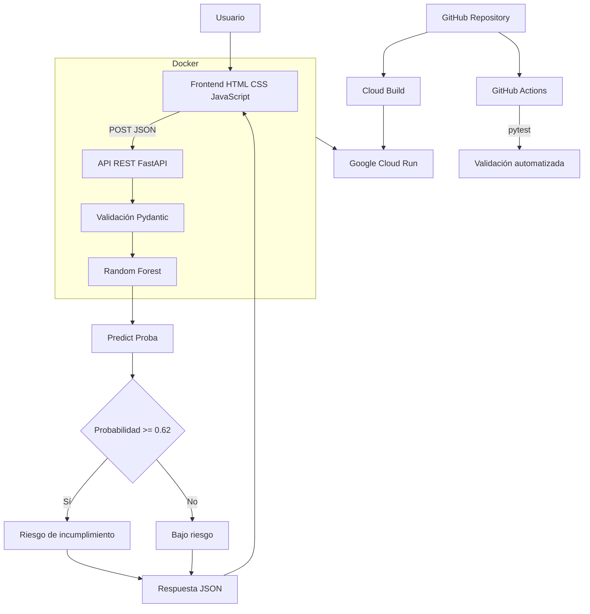

# Arquitectura Final de la Solución

## 1. Diagrama general



## 2. Componentes

### Usuario
Interactúa con el sistema mediante navegador.

### Frontend
Tecnologías:

- HTML;
- CSS;
- JavaScript.

Responsabilidades:

- captura de datos;
- serialización JSON;
- envío de solicitudes;
- presentación de resultados.

### Backend

Tecnología:

```text
FastAPI
```

Responsabilidades:

- exposición de endpoints;
- recepción de solicitudes;
- validación;
- inferencia;
- respuesta JSON.

### Validación

Tecnología:

```text
Pydantic
```

Responsabilidades:

- tipos;
- rangos;
- campos obligatorios;
- rechazo de entradas inválidas.

### Modelo

Tecnología:

```text
RandomForestClassifier
```

Artefacto:

```text
model/random_forest_credito.joblib
```

Umbral:

```text
0.62
```

### Contenedor

Tecnología:

```text
Docker
```

Imagen:

```text
riesgo-crediticio-api:1.0.0
```

### Repositorio

https://github.com/3seatiger-stack/riesgo-crediticio-ml-docker

### CI

Tecnología:

```text
GitHub Actions
```

Validación:

```text
pytest -v
```

### Nube

Tecnología:

```text
Google Cloud Run
```

URL:

https://riesgo-crediticio-ml-docker-602622367890.us-central1.run.app

## 3. Flujo de una solicitud

1. Usuario completa formulario.
2. Frontend crea JSON.
3. Se ejecuta `POST /predict`.
4. FastAPI recibe solicitud.
5. Pydantic valida los campos.
6. Backend construye el vector de características.
7. Random Forest calcula probabilidad.
8. Se compara con 0.62.
9. Se genera clasificación.
10. La API devuelve JSON.
11. El frontend muestra resultado.

## 4. Endpoints

| Método | Endpoint | Función |
|---|---|---|
| GET | `/` | Aplicación web |
| GET | `/health` | Estado del servicio |
| GET | `/model-info` | Metadatos del modelo |
| POST | `/predict` | Predicción |

## 5. Ventajas de la arquitectura

- portabilidad;
- separación de responsabilidades;
- reproducibilidad;
- validación automática;
- escalabilidad;
- facilidad de despliegue;
- trazabilidad.
